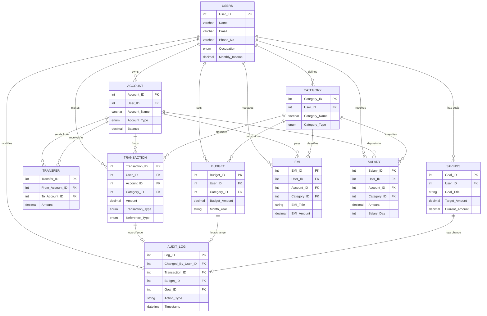

# FinTrack Database Schema Documentation

## Entity Relationship Diagram
> **Note**: You can view this diagram by opening the preview of this Markdown file in VS Code (`Ctrl+Shift+V`), or by opening `FinTrack_ER_Diagram.html` in your browser.

## Table Definitions

### 1. USERS
The central entity representing the application user.
- **Primary Key**: `User_ID`
- **Relationships**: Parent to all other tables.

### 2. ACCOUNT
Represents financial containers like Bank Accounts, Wallets, or Cash.
- **Foreign Keys**: `User_ID`
- **Constraints**: Balance cannot be negative for Cash/Wallet.

### 3. TRANSACTION
The core ledger of all income and expenses.
- **Foreign Keys**: `User_ID`, `Account_ID`, `Category_ID`
- **Triggers**: Automatically updates `ACCOUNT` balance and summaries.

### 4. AUDIT_LOG
Tracks sensitive changes for security and compliance.
- **Foreign Keys**: 
  - `Changed_By_User_ID` -> `USERS`
  - `Transaction_ID` -> `TRANSACTION` (Nullable)
  - `Budget_ID` -> `BUDGET` (Nullable)
  - `Goal_ID` -> `SAVINGS` (Nullable)
- **Behavior**: Records old values on Update/Delete.
